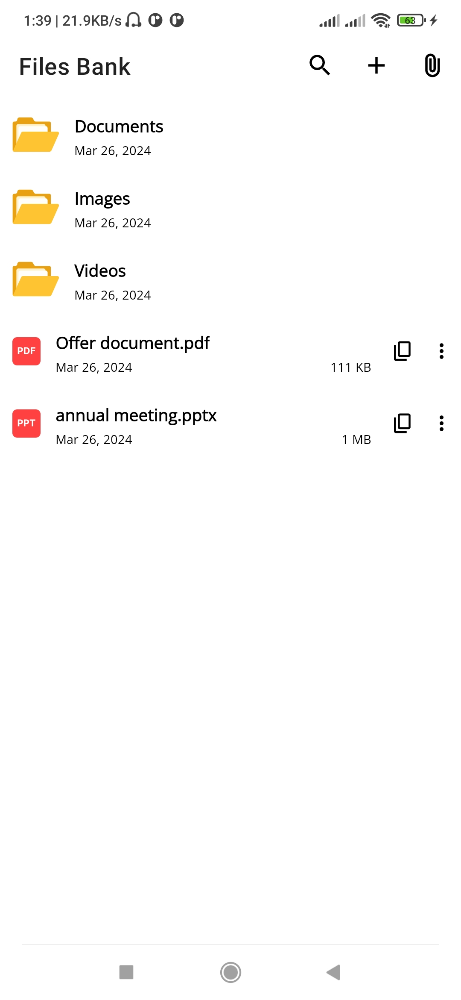
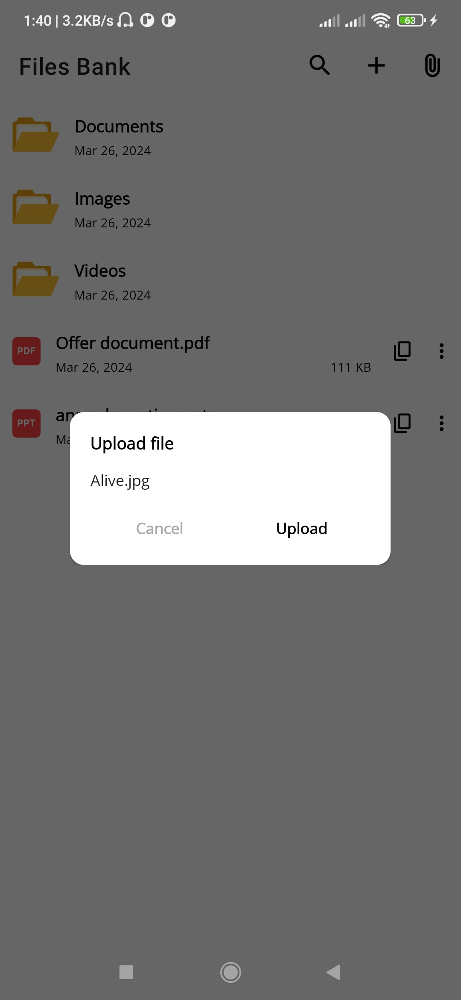
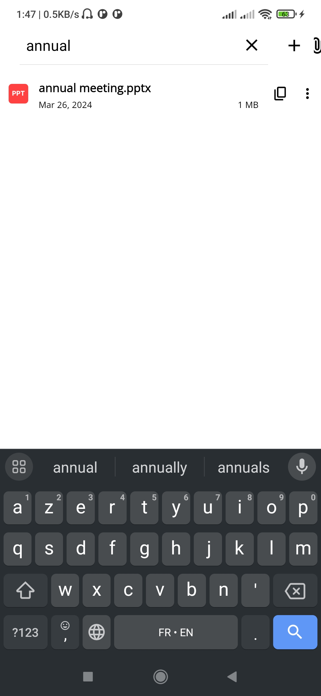
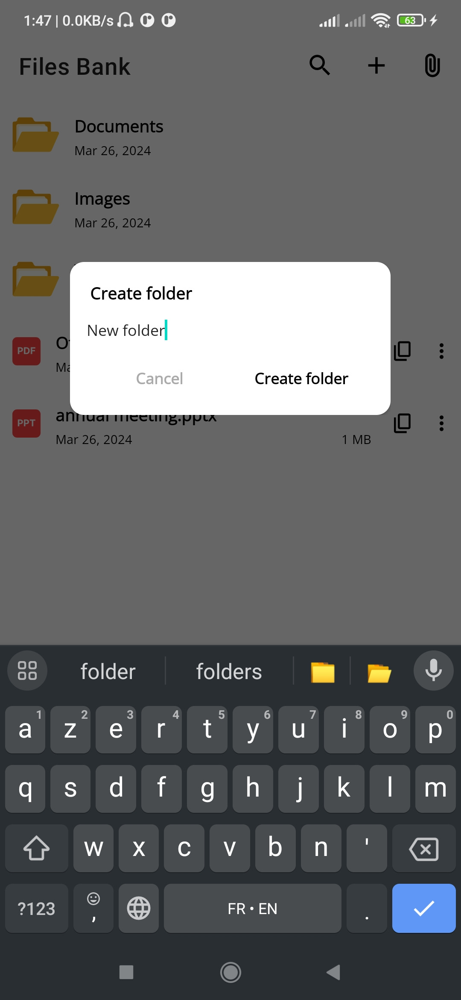
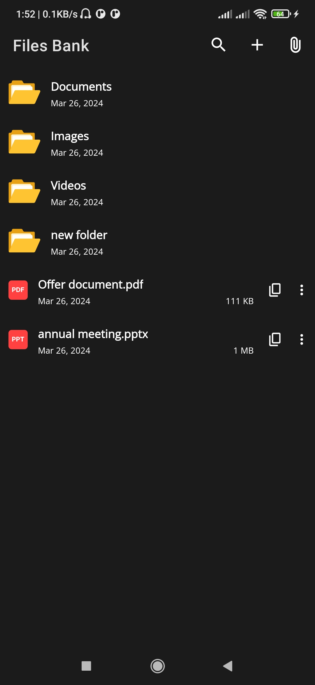

[](https://jitpack.io/#aniszad/AndroidDrivePreview)

# AndroidDrivePreview

AndroidDrivePreview is a library for Android that allows you to seamlessly integrate Google Drive into your application. It provides a user-friendly interface for browsing, managing, and interacting with files stored on Google Drive. This library simplifies the process of working with Google Drive APIs and offers a range of features to enhance the user experience.

<p float="left">
 
 
 
 
 
</p>

## Installation

To integrate the Google Drive File Manager library into your Android project, you can use JitPack.
1.Add the following lines to your root `settings.gradle` file:

```gradle
dependencyResolutionManagement {
    repositoriesMode.set(RepositoriesMode.FAIL_ON_PROJECT_REPOS)
    repositories {
        google()
        mavenCentral()
        maven { url 'https://jitpack.io' }
    }
}
```
2.Add the following lines to your root `build.gradle` file:
```gradle
dependencies {
    implementation 'com.github.aniszad:AndroidDrivePreview:latest-version' // latest version for now : 1.0.6
}
```

## Utilisation

### Example
```kotlin
val gdm = GoogleDriveFileManager(
    this@MainActivity,
    lifecycleScope, // Lifecycle scope for launching coroutines
    Permissions.USER, // Specify the permission level
    CredentialsProvider() // Provide credentials for authentication
)

// Set the recycler view, toolbar, root file ID, root folder name, and file picker listener
gdm.setRecyclerView(binding.recyclerView) // Set the recycler view to display files
    .setActionBar(binding.toolbar) // Set the toolbar to display file name, actions, path
    .setRootFileId("drive-file-id") // Set the ID of the root Drive file to be displayed
    .setRootFolderName("title") // Set the name of the root folder
    .activateNavigationPath(false) // Set to true to display the path of the current directory
    .setFilePathCopyable(true) // Set to true to allow the user to copy the path of the current directory
    .initialize() // Initialize the GoogleDriveFileManager

// Handle back press
val callback = object : OnBackPressedCallback(true) {
    override fun handleOnBackPressed() {
        gdm.navigateBack { this@MainActivity.finish() }
    }
}
onBackPressedDispatcher.addCallback(this, callback)
```

### Public Functions

- `setRecyclerView()`: Sets the RecyclerView that will display the files and folders from Google Drive.

- `setActionBar()`: Sets the toolbar or action bar that will display the current file name, available actions, and navigation path.

- `setRootFileId()`: Sets the ID of the root Drive file or folder to be displayed initially.

- `setRootFolderName()`: Sets the name of the root folder to be displayed.

- `activateNavigationPath()`: Enables or disables the display of the navigation path in the action bar.

- `setFilePathCopyable()`: Allows or disables the ability for users to copy the path of the current directory.

- `initialize()`: Initializes the Google Drive File Manager after all configurations have been set.

- `navigateBack()`: Handles the back press event and navigates back to the previous directory or exits the app if at the root level.

- `setDownloadPath()`: This function allows you to provide a path of a directory (you have to grant access to it) to the library so it downloads files into it. (see example in example app)

## Important

In order to be able to restrict downloading files when viewing files (in the Drive app or another app), the sharing settings for the files need to be changed as follows:

<p float="left">
 
 
 
</p>


